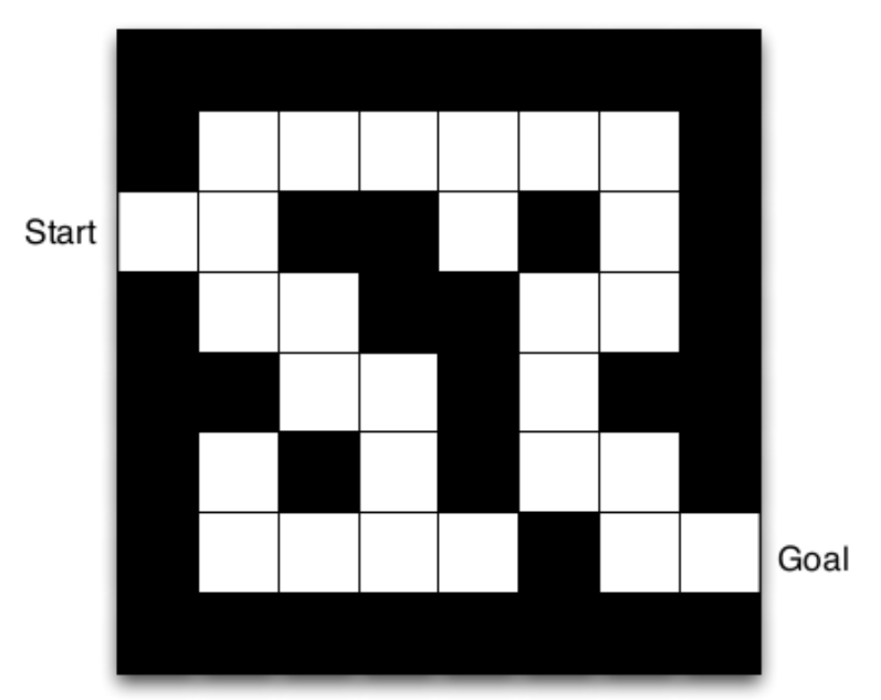
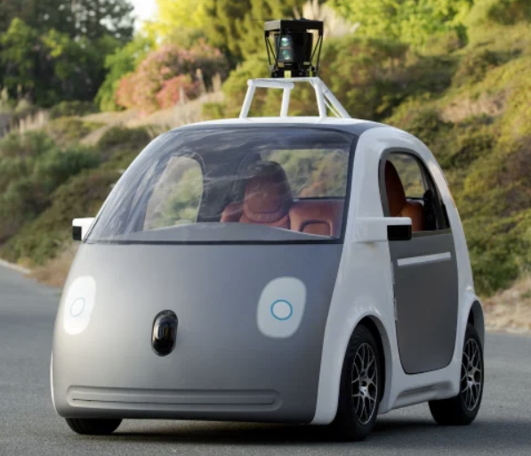
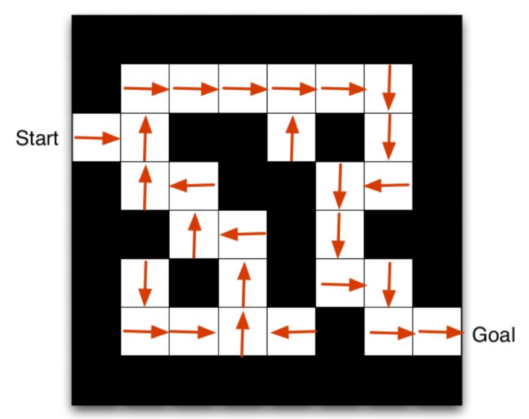
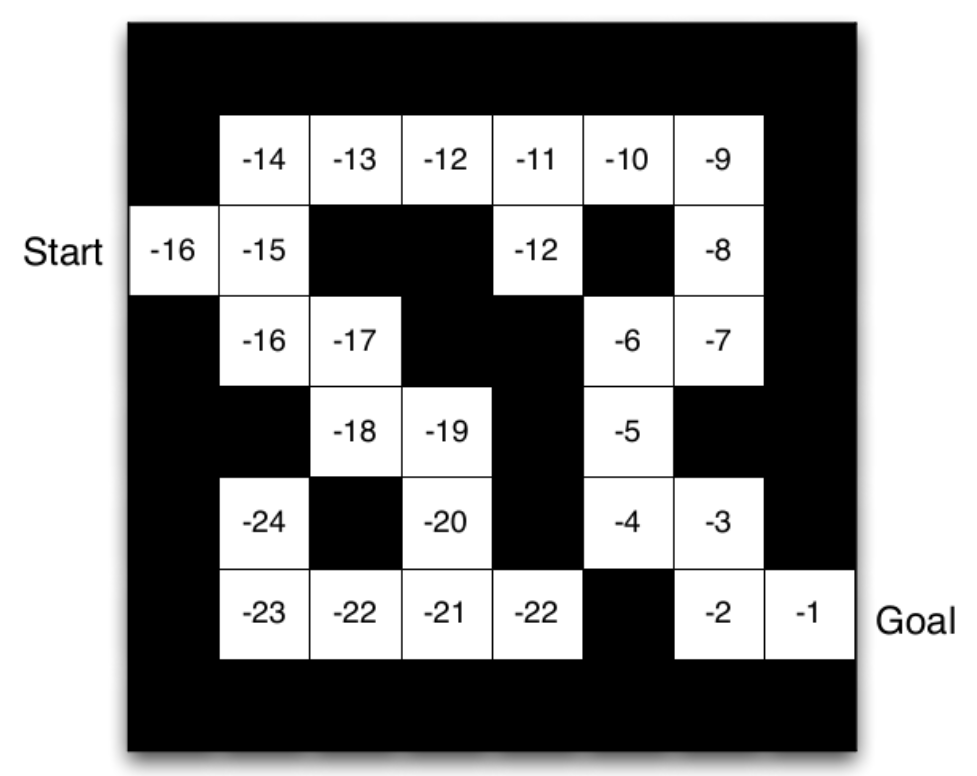

  <h1 class="almost_white">Reinforcement Learning</h1>
  <h3 class="almost_white">Pietro Vertechi & Mattia Bergomi</h3>
  <h4 class="almost_white">{pietro.vertechi, mattia.bergomi}@veos.digital</h4>

  

    
  

---

layout: true

  

---

### Table of contents

- Introduction to Reinforcement Learning (RL).
- Formalization of an RL problem.
- The Bellman equation.
- Learning the structure of the environment:
  - model-free,
  - model-based,
  - embedding.
- Combining Deep Learning and RL.
- Continuous problems.
- Control theory.
- Conclusions.

---

### Introduction

.container[
The goal of RL is to train an agent to solve a task by giving it rewards (*reinforcements*) when it behaves correctly.

Its origins are rooted in behavioral psychology, where rewards can be used to reinforce a given behavior.
]

 

--

  
  
<small>Image Credits: Microsoft Research</small>

--

  
  
<small>Image Credits: Aditya Ganeshan</small>

--

  
  
<small>Image Credits: Time</small>

---

### Problem description

- Set of states $s_1, \dots, s_n$ describing the current *situation* of the agent.

--

- Set of actions $a_1, \dots, a_m$ describing all possible actions the agent can take.

--

- A transition probability $p(s' \, | \, s, \, a)$ of landing in new state, given old state and action.

--

- An expected reward function $R(s, \, a)$, received upon selecting action $a$ in state $s$.

--

- **Important.** The current state encodes *all relevant information* (Markov property).

---

### Policy and value

.container[
The objective of the agent is to develop a policy $\pi(a \, | \, s)$: 
the probability of choosing a given action $a_k$ when in state $s_i$.

For a given policy, there is a notion of *discounted future rewards*:

$$\sum\_{i=0}^\infty \gamma ^ i R\_{t+i},$$

where $\gamma \in (0, 1)$ represents how much we value present reward more than future reward.
]

--

.container[
Using the discount factor $\gamma$, we can compute two important functions associated to the policy $\pi$:
- the discounted future reward of a state $V(s)$,
- the discounted future reward of a state-action pair $Q(s, \, a)$.
]

---

### Value function and Bellman equation

.container[
The value function $V$ and the state-action value function $Q$ are connected by the following equations.
$$
\begin{aligned}
V(s) &= \sum\_{a} \pi(a \, | \, s) Q(s, \, a) \\\\
Q(s, \, a) &= R(s, \, a) + \gamma \sum\_{s'} p(s' \, | \, s, \, a) V(s')
\end{aligned}
$$
]

--

.container[
Assuming that the policy $\pi$ is optimal (always chooses the action with maximum value), the associated functions $V\_\*$ and $Q\_\*$ respect the Bellman equation:
$$
\begin{aligned}
V\_\*(s) &= \max\_{a} Q\_\*(s, \, a) \\\\
&= \max\_{a}  R(s, \, a) + \gamma\sum\_{s'} p(s' \, | \, s, \, a) V\_\*(s').
\end{aligned}
$$

]

---

### Maze example

<small>Image Credits: Aditya Ganeshan</small>

  

--

  

--

  

---

### How to compute the value functions?

There are broadly three classes of methods to compute the value function.

.container[
**Model free.** Do not attempt to learn the structure of the task, and simply update the $Q$ function while performing the task, using some learning rate $\rho$:
$$
\begin{aligned}
&\Delta = R + \gamma V(s') - Q(s, a)\\\\
&Q(s, a) \mathrel{+}= \rho \Delta.
\end{aligned}
$$
Drawback: hard to adjust to changes in the task.
]

--

.container[
**Model base.** Learn all transition probabilities $p(s' \, | \, s, \, a)$ and use the information to plan ahead (think: game of chess).

Drawback: unfeasible for large state spaces.
]

--

.container[
**Embedding.** Embed all states $s_1, \dots, s_n$ in an abstract space, so that nearby states have similar value. For instance, group together states that have similar future trajectories (successor representation).

Drawback: in principle, it can be difficult to build an embedding.
]

---

layout: false
class: center

{pietro.vertechi, mattia.bergomi}@veos.digital
